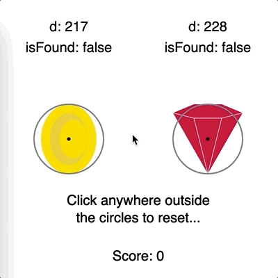

# __Collectable__

The sketch file contains the two available collectable designs together with a visualization of the interaction with each collectable. 
 
The mouse coordinates represent the character's interaction point. In this case, as soon as the mouse falls into the grey circle the collectable disappears and the game score is incremented by the collectable's value. 
 
 

