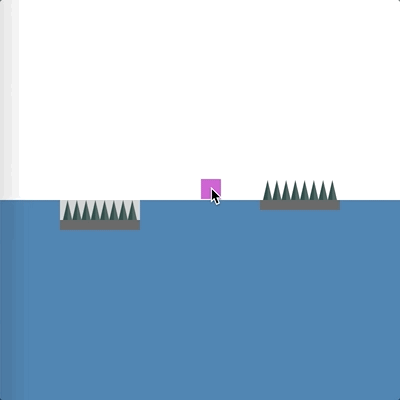

# __Spikes__
The character loses a life once in contact with the spikes rack.  
<br>
## Creating new racks
```javascript
new SpikeRack(x, y, w, h, n, inGround);
```
where,   
`x` the x position in the world,  
`y` the y position in the world,  
`w` the width of the rack,  
`h` the height of the spikes,   
`n` the number of spikes to draw,  
`inGround` whether to draw the rack embedded in the ground, 

<br>

